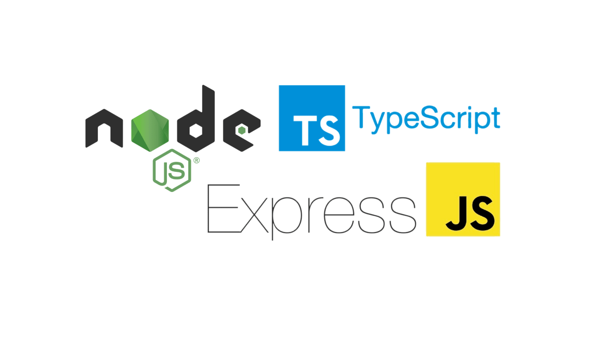

    
    <h1> ExpressJS - NodeJS - TypeScript Boilerplate App </h1>

This repository was created with the intention of providing developers with a
starter app to kick-off their Back-End Projects using ExpressJS-NodeJS-TypeScript.

# Development Tooling

### API Server Utilities

1. [Morgan](https://www.npmjs.com/package/morgan) - HTTP request logger middleware for Node.js
2. [Helmet](https://www.npmjs.com/package/helmet) - It secures your Express apps by setting various HTTP headers
3. [Dotenv](https://www.npmjs.com/package/dotenv) - It is a zero-dependency module that loads environment variables from a `.env` file into `process.env`
4. [CORS](https://www.npmjs.com/package/cors) - It is a node.js package for providing a Connect/Express middleware that can be used to enable CORS with various options
5. [ts-node-dev](https://www.npmjs.com/package/ts-node-dev) - It restarts target node process when any of required files changes (as standard node-dev) but shares Typescript compilation process between restarts

### Testing Tools:

1. [Jest](https://jestjs.io/)
2. [SuperTest](https://github.com/ladjs/supertest)

### Documentation Standard

1. [TSDoc](https://tsdoc.org/)

# How to use it

1. Install pnpm globally in your machine. ([See the official docs](https://pnpm.io/installation))
2. Execute `pnpm run ci` to perform the instalation of all dependencies. (Read [this reference](https://betterprogramming.pub/npm-ci-vs-npm-install-which-should-you-use-in-your-node-js-projects-51e07cb71e26) for more details)
3. Execute `pnpm run dev`, and immediately you will see the vite server running.

# Requirements for daily development workflow

The development considered to be a candidate of a new version within the project,
should comply with the following criteria:

1. **Do not commit a new version if the development is not completed**. Each
   commit is expected to be associated to a single ticket number, it means that
   **only one commit is allowed per ticket assigned** (unless you have to perform a
   merge with main, this will be the extra commit allowed only)
2. **Each commit under the repo must deliver a stable version of the app**
3. The commit must state the title of the task/subtask that was taken
4. Add a description providing the answers to the following questions:
   - How the development in the branch will add value to the project?
   - Is there any remaining work to be done? Please, provide the ticket number
     that will cover this development

### _**EXCEPTIONS:**_

_If there's a need to merge something that wasn't initially scoped
(unexpected bug, or behaviour) it can be done but, following criteria:_

- _The commit description should state which was the issue that popped up and
  the temporal fix applied_
- _It has to reference the ticket that is created to cover that bug fixing,
  following scalability standards_

# IMPORTANT:

Make usage of the command `pnpm run commit:changes` in order to make a new commit.

When executed this will prompt you to define:

1. Type of change you're commiting (a list will be shown to you)
2. What is the scope of this change? (You can skip it, it is not necessary)
3. A short, imperative tense description of the change (Refer to step 3 from the previous list)
4. A longer description of the change (Refer to step 4 from the previous list)
5. Notify if there's a breking change
   - if yes, you'll have to provide details
   - if no, you'll be moved to the next step
6. Notify if this commit affect any open issues
   - if yes, you'll have to add the issue references
   - if no, you'll be moved to the next step
7. The commit will be added to the git history
8. You can push the prevously created commit to the remote repository